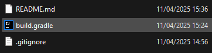

<!-- markdownlint-disable-file MD001 MD033 -->
<h1 align="center"><a href="https://github.com/scales-dev">scales-dev</a>/<a href="https://github.com/scales-dev/Java-3D-Rendering">Java 3D Rendering</a></h1>
<p align="center">Basic rendering of obj files to a JFrame using the CPU</p>
<div align="center">
   
</div>

## Features
- Loading OBJ files: should be able to load most OBJ files and render the contents of them in 3D
- Texture Mapping: should be able to map corresponding textures to OBJ files
- Basic Player Controller: allowing you to easily look around the scene, locks your mouse unless "escape" is held down
- Basic Lighting: taking into account angle difference from normal and distance from light source
- Culling: the closest model to the camera is always drawn on top
- Light Source Rendering: light sources are drawn as inverted (so the normals face the light) cubes centered at light sources
  

## Warning
There was little effort put into optimization as 3D rendering on the CPU is inherently a slow process,
I tried my best to ensure the same calculations are not reran several times, but that is the extent of my optimizations.

## Dev Setup
1. Clone the repo
   ```sh
   git clone https://github.com/scales-dev/Java-3D-Rendering
   ```
2. Open `build.gradle` in IntelliJ IDEA

   
3. Open Project Structure

   

   Set the SDK to any version of the Java 24 JDK

   
4. To run the project in the IntelliJ open `scales.github.Main` and click the run icon left of the class initialiser to 

    

## Compiling Outside IntelliJ
Ensure you have a java 24 jdk set up: [Setup Guide](https://javacodepoint.com/free-download-and-install-jdk-24-on-windows-11/#How_to_Download_JDK_24_for_Windows_11_64-bit)
1. Clone the repo
   ```sh
   git clone https://github.com/scales-dev/Java-3D-Rendering
   ```
2. Type "cmd" into the file explorer tab of the base directory


3. Type "gradlew build" in cmd


4. The compiled file will appear in `[base directory]\build\libs\3d-rendering-1.0-SNAPSHOT.jar`

